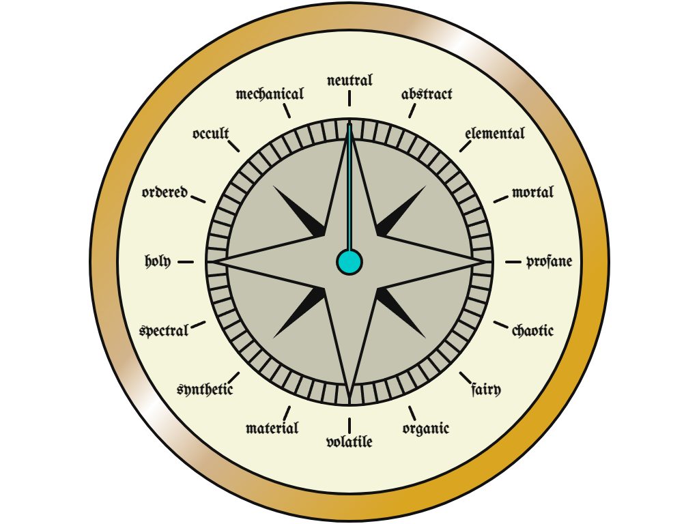

# The Clock of Being

<meta property="og:description" content="The clock of being was a concept created by the celestial bureaucracy to categorize deities into 16 different aspects of being.">

The clock of being was a concept created by the celestial bureaucracy to categorize deities into 16 different aspects of being. It was later extended to most of reality. Physical clocks of being were eventually constructed that could read which specific aspects were present on a specific thing or in a specific location. These aspects were organized to be approximately opposed conceptually when across from each other on the clock, and related when adjacent. However, opposed concepts could both be present.

The aspects are as follows, arranged in a circle:

1. Neutral
   - Opposite volatile
2. Abstract
   - Opposite material
3. Elemental
   - Opposite synthetic
4. Mortal
   - Opposite spectral
5. Profane
   - Opposite holy
6. Chaotic
   - Opposite ordered
7. Fairy
   - Opposite occult
8. Organic
   - Opposite mechanical
9. Volatile
    - Opposite neutral
10. Material
    - Opposite abstract
11. Synthetic
    - Opposite elemental
12. Spectral
    - Opposite mortal
13. Holy
    - Opposite profane
14. Ordered
    - Opposite ordered
15. Occult
    - Opposite faerie
16. Mechanical
    - Opposite organic