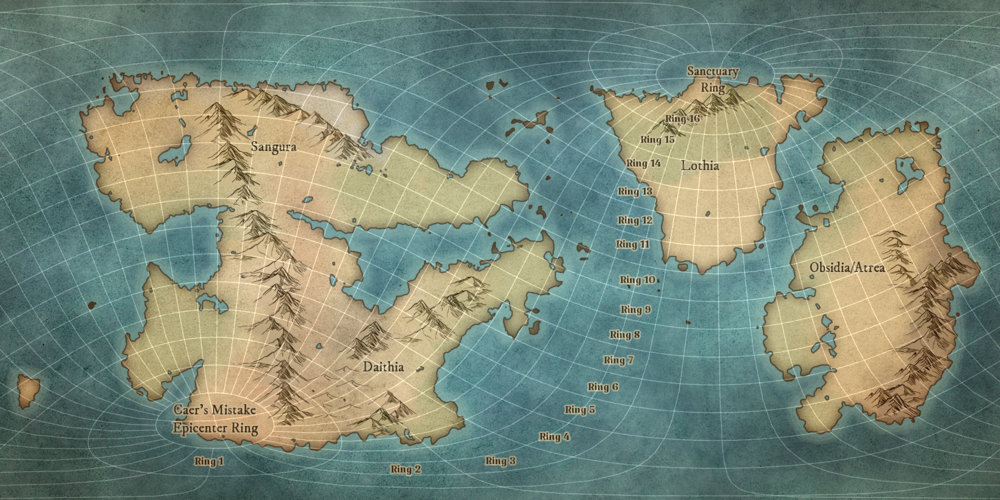

# Anthropic Rings

Distance from the epicenter of [Caer's Mistake](../history/cataclysms/caers-mistake.md) transformed [Ashenal](../inhabitants/anthropoids/ashenal.md) into certain [anthropoid](../inhabitants/anthropoids/introduction.md) species, so those who remained Ashenal on the opposite side of the planet, called the sanctuary ring, long existed as a mostly monolithic culture, while those in between such as the [Meshar](../inhabitants/anthropoids/meshar.md) (ring 10) and [Shaja](../inhabitants/anthropoids/shaja.md) (ring 5) developed several wildly different cultures individually.

The following anthropic rings originated these respective species:

1. [Cicadians](../inhabitants/anthropoids/cicadians.md)
2. 
3. 
4. 
5. [Shaja](../inhabitants/anthropoids/shaja.md)
6. 
7. 
8. 
9. 
10. [Meshar](../inhabitants/anthropoids/meshar.md)
11. [Auergel](../inhabitants/anthropoids/auergel.md)
12. 
13. 
14. 
15. 
16. [Humans](../inhabitants/anthropoids/humans.md)