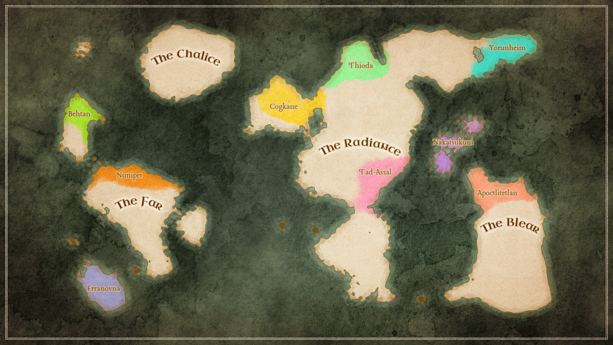

# Regions

<meta property="og:description" content="Regions of Warble, mostly on Warble-d and Tone.">

## Warble-d

Early in its history, Warble-d generally had 1 nation per region, with each nation and region separated by vast areas of wilds, which were inhabited by dangerous creatures and spirits. Later on, magic and industrialization led to human occupation of most available land, as well as connection to the multiverse. Landmasses were grouped into 4 continents, which all used weak proper names.

### Continents

- [The Blear](blear/introduction.md)
- [The Chalice](chalice/introduction.md)
- [The Far](far/introduction.md)
- [The Radiance](radiance/introduction.md)

- [Apoctlitetlan](blear/apoctlitetlan.md)
- [Behtan](far/behtan.md)
- [Cogkane](radiance/cogkane.md)
- [Erranovna](far/erranovna.md)
- [Nakatsukuni](radiance/nakatsukuni.md)
- [Nunipet](far/nunipet.md)
- [Tad-Assal](radiance/tad-assal.md)
- [Yorunheim](radiance/yorunheim.md)